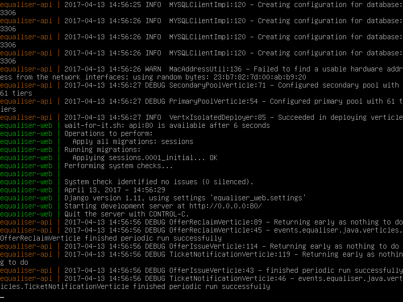

# Equaliser

Welcome to Equaliser's source code repository.

## Branches

| Name                                                                                                     | Description              |
|----------------------------------------------------------------------------------------------------------|--------------------------|
| [equaliser-api](https://git-teaching.cs.bham.ac.uk/mod-60cr-proj-2016/gxb256/tree/equaliser-api)         | Where the magic happens. |
| [equaliser-web](https://git-teaching.cs.bham.ac.uk/mod-60cr-proj-2016/gxb256/tree/equaliser-web)         | Equaliser's website.     |
| [equaliser-android](https://git-teaching.cs.bham.ac.uk/mod-60cr-proj-2016/gxb256/tree/equaliser-android) | The mobile client code.  |

## Spinning up the API and website

Although not detailed in my report for reasons of space, both the API and the website are Dockerised, bringing all the advantages of containerisation. (There would be little point in running the Android app inside Docker.) The following steps describe how to get these two components up and running; they require both [Docker CE](https://docs.docker.com/engine/installation/) and [Docker Compose](https://docs.docker.com/compose/install/). For the sake of keeping your machine clean, I would strongly recommend only building Equaliser on a snapshotted VM. Equaliser's dependencies have a **lot** of secondary dependencies, which challenged my development VM's storage on several occasions.

### VM Setup

This section details how to set up a clean Debian 8 box to run Docker and Java, both of which are required to test Equaliser.

#### [Docker](https://docs.docker.com/engine/installation/linux/debian/#install-using-the-repository)

    # apt update
    # apt install curl apt-transport-https
    # curl -fsSL https://download.docker.com/linux/debian/gpg | apt-key add -
    # echo "deb [arch=amd64] https://download.docker.com/linux/debian jessie stable" > /etc/apt/sources.list.d/docker.list
    # apt update
    # apt install docker-ce

#### [Docker Compose](https://docs.docker.com/compose/install/)

Go to https://github.com/docker/compose/releases/latest to download the latest version.

    # wget -O /usr/local/bin/docker-compose https://github.com/docker/compose/releases/download/1.12.0/docker-compose-Linux-x86_64
    # chmod +x /usr/local/bin/docker-compose

#### [JDK8](https://tecadmin.net/install-java-8-on-debian/)

    # echo -e "deb http://ppa.launchpad.net/webupd8team/java/ubuntu trusty main\ndeb-src http://ppa.launchpad.net/webupd8team/java/ubuntu trusty main" > /etc/apt/sources.list.d/java.list
    # apt-key adv --keyserver keyserver.ubuntu.com --recv-keys EEA14886
    # apt update
    # apt install oracle-java8-installer

### Building and running

 1. Edit your hosts file to point both *equaliser.events* and *api.equaliser.events* to 127.0.0.1, or the IP address of the VM running Docker.
     - *equaliser.events* is a valid, but unregistered domain name. There are two to configure, as Equaliser does not require that the API and website be hosted on the same machine (indeed, if it did, the system would be very difficult to scale).
     - This is necessary as the API returns URLs to images and other static assets, so it needs to know its IP address or hostname. In a production environment, it would not depend on an IP address, so we are using poor man's DNS instead.
 2. Execute `(cd equaliser-api && ./gradlew shadowJar)`.
     - This will download the minimum set of dependencies required for a Gradle build, and compile the project into a single "fat" jar. The whole process should take under a minute.
 3. Now you should be ready to create the Docker images and launch the application with `docker-compose up`.
     - This will take some time, as Docker needs to download several large filesystem layers.

The output from Docker will show various MySQL warnings; these are artefacts of the DBMS starting up for the first time and can be safely ignored, as can messages about uninstrumented methods, which are a known bug in `vertx-sync`. When all components have started successfully, you should see output similar to this:

You can now browse to http://equaliser.events:8081 to see the website, or http://api.equaliser.events:8080 to use the raw underlying API.
